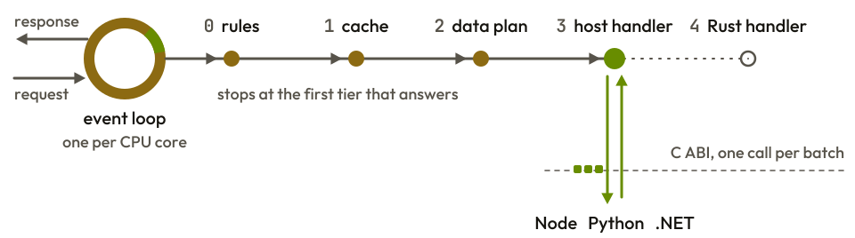

<div align="center">

<picture>
  <source media="(prefers-color-scheme: dark)" srcset="assets/zero-logo-animated-dark.svg">
  <source media="(prefers-color-scheme: light)" srcset="assets/zero-logo-animated.svg">
  
</picture>

A memory-safe HTTP server core in Rust, being built so that TypeScript, Python
and C# applications run on one engine through one C ABI.

**Pre-release.** Nothing is published yet. From Rust, the core already serves
HTTP/1.1 and HTTPS with routing, static files, WebSocket and server-sent
events. The Node binding and the rest of release 1 are in development.

</div>

## Why

Every language brings its own web framework, and each one rebuilds the same
parsers, the same router and the same connection handling, with its own bugs and
its own limits. zero-server takes the opposite bet: write the server once, in
Rust, and let every language use that one core. Four rules shape the code:

- **One core for every language.** TypeScript, Python and C# get idiomatic
  packages over the same Rust engine, so a fix lands in every language at once.
- **Every parser follows its specification.** Wire formats are written from the
  current RFC text, and every statement the code relies on is a row in a
  registry with a test pinned to it.
- **Installing never compiles.** Bindings are meant to ship prebuilt for seven
  targets, so installing one needs no Rust toolchain and no C compiler.
- **The hot path stays in Rust.** Routes, files, policy rules, caching and
  queries are data the core runs itself; code in the host language is called
  once per batch of requests, not once per request.

## How it works

<picture>
  <source media="(prefers-color-scheme: dark) and (max-width: 600px)" srcset="assets/architecture-narrow-dark.svg">
  <source media="(max-width: 600px)" srcset="assets/architecture-narrow.svg">
  <source media="(prefers-color-scheme: dark)" srcset="assets/architecture-dark.svg">
  
</picture>

This is the design release 1 builds toward.

**One event loop per CPU core.** Each core runs its own non-blocking loop with
its own memory, and on Linux its own listener. A connection stays on the core
that accepted it, so the request path takes no locks.

**Two runtime backends behind one seam.** The core reaches the operating system
through one interface: tokio by default, or compio with io_uring on Linux, IOCP
on Windows and kqueue on macOS. TLS runs on both, with a driver suited to each.

**Five tiers, cheapest first.** A request stops at the first tier that can
answer it: declarative rules such as CORS and static files, the core's cache, a
data plan the core runs on its own database connection, a handler in the host
language, or a handler in Rust. Only the host-language tier leaves Rust.

**One boundary.** The bindings reach the core through a single C ABI,
`zero-ffi`, whose header is generated on every build. A request crosses it as a
small integer id, never as an object, and a panic never crosses it at all.

**Codecs that need no operating system.** The HTTP/1.1, WebSocket and
server-sent event codecs, the router and the parsers around them are `no_std`,
and CI builds them for a bare-metal target. The QPACK and HTTP/3 frame codecs
join them in release 1.

## A first look

This Rust program runs today. It answers `GET /users/:id` with the id, and the
router answers every other path and method on its own with 404, 405 or 501:

```toml
[dependencies]
zero-server = { git = "https://github.com/molexxxx/zero-server", default-features = false, features = ["http"] }
```

```rust
use std::net::SocketAddr;
use std::sync::Arc;

use zero_server::core::Error;
use zero_server::http::{serve, Call, Config, Handler, Router};
use zero_server::http_types::Method;

#[derive(Clone, Copy)]
enum Route {
    User,
}

struct App {
    router: Router<Route>,
}

impl App {
    fn new() -> Self {
        let mut router = Router::new();
        router
            .route(Method::Get, "/users/:id", Route::User)
            .expect("the pattern is valid");
        App { router }
    }
}

impl Handler for App {
    async fn handle(&self, call: &mut Call<'_>) -> Result<(), Error> {
        let Some(routed) = call.route(&self.router) else {
            return Ok(());
        };
        match routed.descriptor {
            Route::User => {
                let (request, mut response) = call.parts();
                response.content_type(b"text/plain")?;
                response.body(request.param(0).unwrap_or_default());
            }
        }
        Ok(())
    }
}

fn main() -> std::io::Result<()> {
    let workers = serve(
        SocketAddr::from(([127, 0, 0, 1], 3000)),
        Config::default(),
        Arc::new(|_| {}),
        |_| App::new(),
    )?;
    println!("listening on {}", workers.local_addr());
    workers.join()
}
```

`serve` starts one worker per logical CPU and calls the last closure on each one
to build that worker's handler. The third argument receives status events, such
as a worker that started, stopped or panicked; this one ignores them.

To serve HTTPS, turn on the `tls` feature and start the same handler with a
certificate. A request whose `Host` the certificate does not cover is answered
421:

```rust
use zero_server::tls::{Identities, Identity, TlsOptions};

let site = Identity::from_pem_files("cert.pem", "key.pem", &["example.com"])?;
let workers = zero_server::tls::serve(
    SocketAddr::from(([0, 0, 0, 0], 443)),
    Config::default(),
    Arc::new(Identities::new(&[site], None)),
    TlsOptions::default(),
    Arc::new(|_| {}),
    |_| App::new(),
)?;
```

The Node package is built to ship this shape in release 1. It does not run yet:

```ts
import { createApp, cors } from '@zero-server/sdk'

const app = createApp()
app.use(cors({ origin: 'https://example.com' }))

app.get('/users/:id', (req, res) =>
{
  res.json({ id: req.params.id })
})

app.listen(3000)
```

`cors` becomes a rule the core applies in Rust; the `/users/:id` handler runs in
JavaScript, called in batches. Python and C# get the same shape in release 2.
Today each binding loads the compiled core and reports its version, as the
guides show for [Node](bindings/node/guides/version.ts),
[Python](bindings/python/guides/version.py) and
[.NET](bindings/dotnet/samples/ZeroServer.Guides/VersionGuide.cs).

## Status

Every crate and package is at 0.1.0 and none is published. What runs today is
the Rust core; the bindings load it and report its version, and nothing else
crosses the C ABI yet.

**In place today**

- **HTTP/1.1.** Pipelined requests answered in order, `Expect: 100-continue`,
  chunked request bodies with trailers, body limits for the server and for each
  route, timeouts for the head, an idle connection, the body and the whole
  request, a memory budget per core, and a shutdown that lets in-flight
  requests finish.
- **Errors.** Handler errors answered as RFC 9457 problem details from one error
  registry, and a panicking handler answered 500 while its connection and its
  core keep serving.
- **Routing.** Path parameters, catch-alls and mounted routers, answering 404,
  405 with `Allow`, 501, `HEAD` and `OPTIONS` on its own.
- **Static files.** A policy on every path segment that refuses traversal,
  dotfiles and Windows stream and short names, a root that symbolic links
  cannot leave, ETag and Last-Modified validators, conditional requests, byte
  ranges and a per-core cache of small files.
- **WebSocket.** The handshake with subprotocol and origin checks, fragmented
  messages, ping and close handling, and rooms whose broadcasts reach members
  on every core.
- **Server-sent events.** Keep-alive comments, `Last-Event-ID` and streams that
  end cleanly on shutdown.
- **TLS.** TLS 1.3 and 1.2 through rustls on both runtime backends: the
  certificate chosen by server name and replaceable without a restart, session
  tickets that rotate, no 0-RTT data, the handshake timed and limited per core,
  `close_notify` on every close, and 421 for a host the certificate does not
  cover.
- **Request rules.** CORS, security response headers, Fetch Metadata, request
  ids, trust proxy and body limits per path prefix, as functions a handler
  calls.
- **Codecs.** JSON, URIs, query strings, media types with `Accept` negotiation,
  base64 and HTTP dates, plus SHA-1, SHA-256, constant-time comparison and
  secrets that are zeroed when dropped.
- **Groundwork.** The C ABI with its generated header, the three binding
  skeletons with smoke tests, the standards registry, fuzz targets for the
  HTTP/1.1, JSON, URI, query string and router parsers, and CI.

**Release 1, in development**
- [x] HTTP/1.1 with pipelining, the router and static files
- [x] WebSocket and server-sent events
- [x] TLS through rustls
- [x] CORS, security headers and the other request rules, called from a handler
- [ ] The same rules applied before any handler runs
- [ ] The QPACK and HTTP/3 frame codecs, ahead of the transport
- [ ] Request slots and the C ABI calls the bindings make
- [ ] The Node binding with its TypeScript facade
- [ ] The standalone `zero` server binary

**Release 2, planned**
- HTTP/2 and streaming request and response bodies
- PostgreSQL, the cache and data routes
- JWT, sessions, mTLS
- The Python and C# packages

**Release 3, planned**
- HTTP/3 over QUIC
- MySQL, MongoDB, Redis and SQLite, and the ORM
- gRPC, observability, WebRTC signaling

The JavaScript framework that came before this core, `@zero-server/sdk` 1.x, now
lives in [molexxxx/zero-server-node](https://github.com/molexxxx/zero-server-node).
The Node package here takes over that name at 2.0, once it does everything 1.x
does.

## Packages

- **Rust:** the `zero-server` crate, or one `zero-<capability>` crate per need
- **TypeScript and Node:** `@zero-server/sdk`, over napi-rs
- **Python:** `zero-server`, over PyO3
- **C# and .NET:** `ZeroServer`, over `[LibraryImport]`
- **C:** the header `crates/zero-ffi/include/zero.h`

The `zero-server` crate turns every capability on by default. With
`default-features = false`, each one is a feature named after its crate, such as
`http`, `static`, `realtime` or `tls`, and `io-compio` selects the compio
backend.

## Standards and safety

- **Standards first.** [`docs/standards.toml`](docs/standards.toml) lists every
  specification the core is held to, 545 statements, each with the release that
  ships it and, once it ships, the test that pins it. Nothing is implemented
  from memory: the cited source is read first and the code cites its section.
- **Unsafe code is fenced.** It is forbidden everywhere except a few audited
  crates, each listed with its inventory in [SECURITY.md](SECURITY.md).
- **Checked on every push.** CI runs the dependency allowlist and audits, Miri,
  AddressSanitizer and ThreadSanitizer, fuzzing, a reproducible-build check and
  a hardened build of the C ABI.

## Building from source

```sh
cargo build --workspace
cargo test --workspace
just ci            # what the main CI job runs
```

[CONTRIBUTING.md](CONTRIBUTING.md) covers the toolchain, the Docker recipe for
rustfmt and clippy, and what a change is held to.
[docs/brand.md](docs/brand.md) holds the logo and palette.

## License

Apache License 2.0. See [LICENSE](LICENSE).
